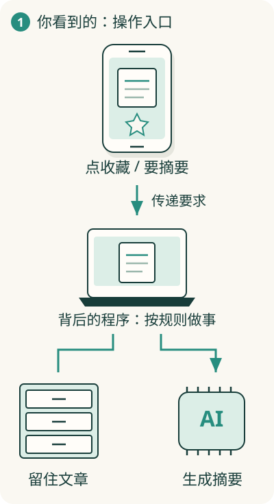

# 你点一下，软件里面发生了什么？

你在手机上点“收藏”，一篇文章就进入收藏夹。这个小动作，已经包含了理解软件的三个起点：**有人发出要求，程序按规则做事，系统记住结果。**

软件世界模型，就是把这些看不见的工作连起来。你能在脑中解释“它为什么会这样”，技术名词才有地方安放。

## 从一个阅读助手看进去

假设我们做一个阅读助手：你放入文章，它帮你收藏、搜索，还能用 AI 写摘要。这是全库用来讲原理的虚构产品，你不需要真的把它做出来。

你看见的是屏幕上的文章、按钮和摘要。屏幕背后，有程序判断你点了什么，有地方保存文章；如果需要 AI，还要把文章交给模型，再把回答带回来。**界面是你接触软件的入口，背后还有负责做事和记事的部分。**

这张图画的是一个联网产品。一个离线笔记本可以把处理和保存都放在自己的电脑上。软件不一定都长得一样，值得追问的是：这些工作由谁完成，在哪里完成？

## 先抓住四件事

**做事**：程序收到“收藏这篇”的要求，执行收藏规则。没有规则，按钮就只是一张能点击的图。看[程序怎样做事](01-computation/01-program.md)。

**记事**：收藏之后，系统要留下“这篇属于我的收藏”的记录，下次打开才找得到。看[软件怎样记住事情](02-state/06-state.md)。

**合作**：手机、负责处理的程序、保存文章的地方，可能不在同一台设备上。它们需要传递信息。看[前端和后端](03-communication/09-client-server.md)。

**持续可用**：网络会断，用户会变多，产品会更新。还要安排失败后的处理和修改后的检查。看[系统为什么会失败](05-reliability/17-failure.md)。

这四件事经常一起发生。收藏既是一次处理，也改变了记忆；搜索既要读取记忆，也要计算结果。

## 七个方向，是七种看同一软件的方式

| 你现在的疑问 | 从这里进入 |
| --- | --- |
| 电脑怎么照着代码做事？ | [计算与运行](01-computation/01-program.md) |
| 软件记住了什么，记在哪里？ | [数据与状态](02-state/06-state.md) |
| 手机和远处的程序怎样联系？ | [通信与协作](03-communication/09-client-server.md) |
| 一大堆工作怎样分给不同部分？ | [边界与架构](04-architecture/13-boundaries.md) |
| 怎样应对失败、权限和速度问题？ | [可靠性与信任](05-reliability/17-failure.md) |
| 做好的软件怎样上线、更新和检查？ | [演进与交付](06-evolution/21-delivery.md) |
| AI 在其中负责哪一部分？ | [AI 软件](07-ai/24-model.md) |

## 第一次来，读这六篇就能连成一张图

[程序](01-computation/01-program.md) → [运行](01-computation/02-runtime.md) → [状态](02-state/06-state.md) → [前后端](03-communication/09-client-server.md) → [分工](04-architecture/13-boundaries.md) → [AI 模型](07-ai/24-model.md)。这是阅读建议，所有文章都可以直接打开。

暂时不用背名词。先能说出“这个产品要做哪些事、记住哪些事、让哪些部分合作”，你就在建立自己的软件地图。
