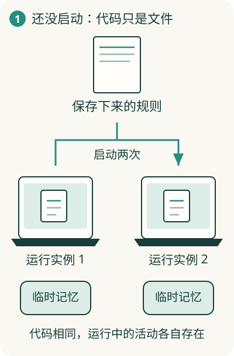

# 代码放在那里，为什么软件还没开始工作？

一份菜谱放在桌上，饭不会自己出现。同样，写好的代码放在文件里，也不会自动回应你的点击。**运行，就是让电脑开始执行代码里描述的工作。**

菜谱只用来说明“说明书和实际做事不同”。电脑执行的是明确的指令，没有厨师那样的生活理解能力。

## 文件是静止的，运行会占用电脑

假设阅读助手的代码已经写好。启动以前，代码是一批保存着的文件。启动以后，电脑开始处理点击、读取文章，还要暂存当前打开的内容。

这份正在进行的程序活动，会占用电脑的计算和记忆空间。操作系统把这样的运行实例叫作**进程**。操作系统就是电脑上负责安排各个程序使用机器的基础软件，例如 Windows 或 macOS。

图中两扇窗口代表两个运行实例，不表示每个真实窗口都恰好对应一个进程。你需要先看懂的是：**一份代码，可以产生多份正在工作的实例。**

## 谁把代码里的话变成机器动作？

机器最终执行自己的指令。人写的编程语言，需要相应的软件来执行或转换。不同语言的过程有所不同：有些先转换成机器能执行的形式，有些交给语言执行器处理。

执行代码时所需的这套支持，常被称为**运行时**。例如浏览器带有执行 JavaScript 的能力，所以网页中的这类代码能在浏览器里工作。你不必先学 JavaScript，先理解“代码需要与它匹配的执行能力”。

运行时和操作系统各管一层：前者支持特定语言的执行，后者安排程序使用电脑。仅有操作系统，未必已经有某种代码需要的全部支持。

## 为什么换一台电脑，程序可能跑不起来？

代码可能还需要别的现成软件，比如读取 PDF 的组件。它用到了对方的能力，就对对方形成了**依赖**。新电脑如果没准备这些组件，即使代码一样，也可能无法完成工作。

因此“软件能运行”要同时具备：要执行的代码、合适的执行支持，以及它需要的其他能力。这些条件合在一起，可以叫运行环境。

关闭软件会结束一些运行中的活动和临时记忆，已经保存到文件里的内容则可以继续留下。理解这个区别，接着读[计算、内存和存储](03-resources.md)，就容易知道机器各部分在做什么。
