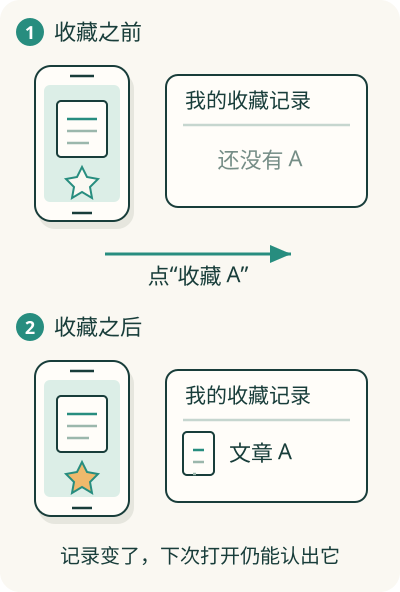

# 为什么软件能记得你刚才做过什么？

你把同一篇文章打开两次。第一次它没有收藏标记；点过收藏以后，第二次打开，星星已经亮了。文章没变，你的动作也一样，软件的反应却变了。

原因是系统留下了“你收藏过这篇文章”的信息。**那些留在系统里、会影响接下来行为的信息，就是状态。**

## 先看一个动作前后的区别

在这个假设的阅读助手里，点击以前，你的收藏清单里没有文章 A。点击以后，清单里有了文章 A。页面再查这份清单，就知道应该把星星点亮。

亮星星是显示给你的结果。背后的记录解释了为什么下次还能显示同样的结果。有些产品会先亮星星，再等待保存成功；这时亮了也可能还没真正保存。**屏幕上的样子和背后的记录，需要配合。**

## 软件的记忆有长有短

你还可能展开目录、输入一半搜索词、选中一篇文章。软件也要记住这些信息，才能继续当前操作。它们同样是状态，但不一定值得永久保存。

想象一张工作桌：手边便签帮助你处理眼前的事，归档的记录留到下次使用。软件中也有这类区别：有些信息只留在运行中的临时记忆里，有些写到可以长期保留的文件或数据库里。数据库是帮助程序组织、查找、修改记录的软件。

这只是寿命的类比。临时和长期信息都可能在你的设备上，也都可能在远处的电脑上；不能只凭“前端”或“后端”判断是否会丢。

## 一份事实，可以带出几种显示

如果清单里有三篇收藏，页面可以显示“收藏 3 篇”。这个数字能由清单数出来。程序员会叫它**派生状态**：从已有信息算出的信息。

于是这里有三种不同东西：收藏清单是记录；“3 篇”是从记录算出的结果；当前展开哪个目录是界面临时记住的选择。分清它们，才容易说明哪份东西改变时，什么显示要跟着改变。

## 从“能记住”走到“记在哪里”

只在你的手机保存收藏，另一台电脑通常看不到它。希望跨设备使用，就需要一份两边都能访问的记录，或者安排两边交换更新。

这自然引出[存储](07-storage.md)和[一致性](08-consistency.md)：前者解释怎么留住和找出信息，后者解释多份信息怎样对上。你现在先抓住一个判断：**软件会因为已经记住的事情，而对下一次输入作出不同反应。**
