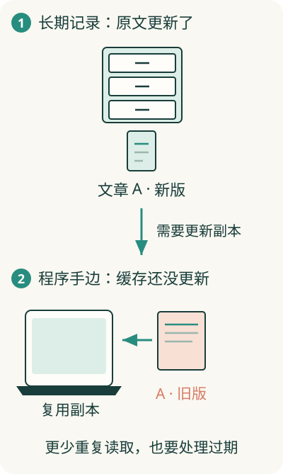

# 文章、账号、图片，为什么不全放在一个地方？

阅读助手需要保留文章正文、谁收藏了什么、封面图片。它还希望你打开常看的文章时快一点。不同东西，保存和取用的需要并不相同。

**存储负责留住信息，也决定程序用什么方式把信息找回来**。文件、数据库、缓存，是常见的三种安排。

## 文件适合留下一整份东西

一张图片、一份 PDF、一段录音，可以作为完整文件保存。程序根据文件的名字或地址把它取回来。

联网产品里，大量这类文件可以交给专门的文件保存服务。其中常见一种叫**对象存储**：程序把一份内容作为一个对象存入，再凭它的标识取出。它擅长管理整份内容，不负责替你理解其中每个人的收藏关系。

## 数据库适合管理能查、能改的记录

想查“小林收藏了哪些文章”，就要在许多记录中筛选；取消一篇收藏，还要改掉对应关系。**数据库**帮助程序组织记录、查找和更新，也能检查一些约束。

它像带检索能力的登记系统。记录可以保存文字，也可以保存指向图片文件的地址。因此数据库和文件经常合作，并非只能二选一。

## 缓存把常用结果留在近处

假设每次打开首页都重新统计文章数量。程序可以把刚算出的数量暂存起来，下次先复用，减少重复工作。这份为加快使用而保留的结果，叫**缓存**。

缓存像手边的一张速查纸，通常能从原始记录重新获得。如果新增文章后还使用旧数量，就会暂时看到过期信息。缓存需要安排何时更新或作废。

## 保存地点，还决定谁能取到

只留在本机的记录，另一台设备通常不能直接访问。共同放在可访问的服务上，就方便多设备读取，但也要处理权限、网络和多人修改。

选存储时，先问：要留住什么，谁需要取到，需要查哪些信息，能允许多旧的结果？不用先背品牌。知道这些需要，再理解[多份信息怎样对上](08-consistency.md)就有了基础。
