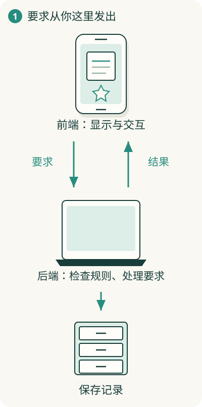

# 前端、后端、服务器，分别在哪里？

你用手机打开阅读助手，朋友用电脑打开同一个产品。两人看的是各自的屏幕，却可能读到同一篇文章。这意味着：各自的操作入口，在和某个共同提供能力的地方合作。

**客户端是你使用的一端，服务端是接受要求、提供能力的一端**。浏览器里的网页和手机 App 都可以是客户端。

## 你面前的界面做哪些事？

页面把文章排好、显示按钮、响应点击，还可能先检查搜索词是否为空。这些靠近用户交互的工作，通常归到**前端**。

你在屏幕上点收藏时，前端可以把“当前用户想收藏文章 A”送出去。这个向对方提出的要求，叫请求。它收到结果后，再告诉你成功还是失败。

## 共同使用的部分做哪些事？

服务端可以确认是谁在操作、检查权限，再把收藏记录保存下来。这里处理共享记录和业务规则的工作，通常叫**后端**。

把共同的规则放在这里，各种客户端就能使用同一套收藏规定。但客户端也可以做本地计算和保存；“前端只负责好看”会漏掉很多实际工作。

## “服务器”是程序，还是电脑？

这个词在日常说法里可以指提供服务的程序，也可以指运行这些程序的机器。听见“服务器出问题”，还需要看说的是哪一层。

机器可能放在机房里，也可能租用云平台的计算能力。“云”仍然依靠真实电脑，只是使用者通过网络取得能力，不需要把那台机器放在自己的桌边。

## 所有软件都要有远处后端吗？

离线笔记软件可以在本机完成显示、处理和保存。联网阅读助手把共享内容和账号记录放到远处，是为了跨设备和多人访问等需要。

前后端主要描述工作职责；本机和远处描述位置。两者要一起看，不能仅凭词判断所有信息在哪里。双方怎样互相听懂，接着看[接口与协议](10-interface.md)。
