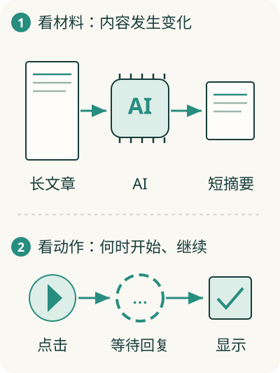

# 点“生成摘要”后，文章内容去了哪里？

你点“生成摘要”，页面稍后显示一段短文字。要解释这件事，可以追两条线：**材料经过哪里、变成了什么；哪些动作让工作开始或继续。**

这两条线分别叫数据流和控制流。分开看，复杂流程就更容易理解。

## 先跟着材料走

假设阅读助手把文章正文取出来，和“请用三句话概括”的要求放在一起，交给 AI。AI 返回摘要，软件再把摘要放到页面上。

这里的材料发生了变化：保存着的正文，变成供模型阅读的输入，再产生一份摘要。追踪信息来自哪里、经过哪些处理、最后在哪里使用，就是看**数据流**。

## 再跟着动作走

你点击按钮，软件开始请求摘要；收到回复，软件才显示摘要。如果请求失败，可能显示失败提示。这些动作何时发生、什么条件让它们发生，就是**控制流**。

“被点击”“收到回复”这类发生了的事情，叫**事件**。程序可以安排：当某个事件发生，就执行相应工作。它解释了为什么软件常常需要等待用户或消息，并不一直沿着一条直线往下跑。

## 两条线有联系，却不能互相替代

点击按钮让生成开始，但“点击了”这件事不是摘要的主要材料；正文才是。模型可能从数据库取得文章，这说明信息来源，也不说明数据库会主动决定什么时候生成。

因此画图时，箭头要说明含义：在传材料，还是在触发动作？如果一个箭头同时表示三种事情，读者就很难知道软件怎样工作。

## 从这两条线看整个产品

做阅读助手时，数据线帮你看见文章、提示要求、摘要的去向；动作线帮你看见点击、等待、成功或失败。这也让你知道需要保存哪些信息，以及等待时页面应该显示什么。

到了 AI Agent，这个过程会反复发生：取得材料、决定行动、执行、看到新结果，再决定下一步。先把这两条线分清，后面理解[Agent](../07-ai/25-agent.md)就有支点。
