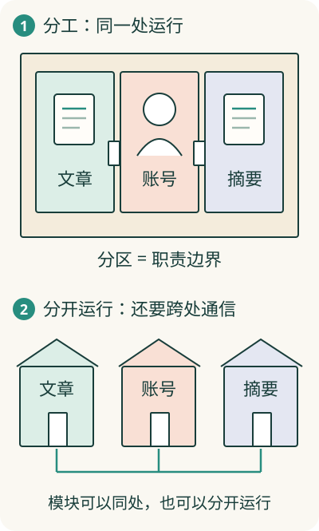

# 软件那么多工作，怎样分给不同部分？

假设阅读助手已经能收藏文章，现在还要支持 AI 摘要。如果把“谁登录了、文章存在哪里、怎么请求摘要、按钮怎么显示”混在一起，每改一个功能，都要理解一大片工作。

**分工的目的，是让每一部分有明确的工作范围，其他部分能放心使用它提供的能力**。这就是理解软件结构的起点。

## 像一间有分区的工作室

一间工作室里，可以划出接待区、档案区和写作区。分区以后，接待者知道去哪里取档案，写作者也知道谁负责保存成品。它们仍可以在同一间屋子里。

软件里，围绕一项职责组织起来的一部分代码，叫**模块**。例如阅读助手可以有文章管理模块、账号模块、摘要模块。模块的名字要回答“它负责什么”。

这幅图用房间表示软件的分工。真实模块由代码组成，分区线表示职责范围，不是电脑里真的有墙。

## 分界线怎样帮助合作？

摘要模块需要文章内容。它可以向文章模块说“给我文章 A 的正文”，由文章模块找到并返回。它不用自己钻进文章模块，翻找对方的全部存储细节。

这种明确的交接方式就是[接口](../03-communication/10-interface.md)。模块之间的**边界**，规定谁可以负责哪些工作、双方用什么方式合作。

这样，文章模块以后换一种保存方式，只要仍能正确提供正文，摘要模块就可能继续使用。能否做到这一点，取决于交接约定是否保持相容。

## 分文件夹，不会自动带来分工

如果摘要模块直接修改账号记录，账号模块又到处改文章内容，即使文件分成三堆，实际职责仍纠缠在一起。判断分工要看行为：谁能改什么，谁提供什么，谁需要了解谁的细节。

适合放在一起的，通常是围绕同一工作、经常一起变化的规则与信息。例如收藏归谁所有、怎样加入收藏、怎样取消收藏，放在共同的管理范围内更容易保持规则一致。

## 分模块以后，要不要分成多个服务？

多个模块可以一起运行，也可以分别运行、通过网络合作。能独立提供能力的运行部分，常叫服务。

把三项工作放到三处，可能便于单独更新或增加处理能力，也增加了信息传递、等待和失败的处理。初学时先分清职责，再理解运行位置的选择。可以继续看[软件有哪些组织形态](16-shape.md)。
