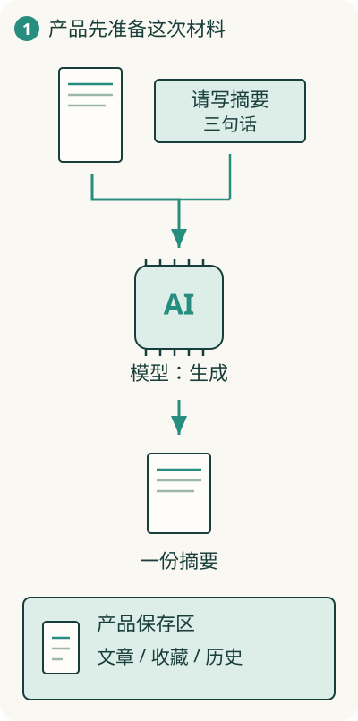

# AI 在软件里负责什么，其他部分还用来做什么？

阅读助手能保存文章，也能生成摘要。保存一份记录可以按明确规则做；把长文章概括成几句话，则需要理解和生成文字的能力。

**AI 模型可以作为软件中的一项能力，负责理解、生成或选择；整个产品还需要其他部分组织这项能力。**

## 模型吃进材料，给出输出

假设软件把文章正文和“写三句话摘要”的要求交给模型。模型根据这些输入，生成一段文字。使用训练好的模型处理输入、产生输出，这个过程叫**推理**。

模型这次实际得到的要求、正文、对话等材料，叫**上下文**。如果文章根本没被送进去，模型就不能据此准确概括那篇文章，可能只能根据已有输入和训练中形成的能力猜测。

## 三种“记忆”先分开看

训练使模型形成了处理语言和信息的能力，但不等于它记住了你产品数据库里的每条私人记录。这次提供的上下文让它接触具体材料；产品里的数据库则保留文章、收藏和历史结果。

所以一个聊天产品“下次还记得你说过什么”，可能是产品保存了对话，下次重新提供给模型。不能直接推断模型自身永久记住了这些话。

## 材料太多时，先找到相关的

如果收藏有上万篇，通常不必每次都把全文全部送给模型。软件可以先查出与问题相关的文章，再提供给模型。这一步叫**检索**。

把检索所得材料交给模型辅助生成，常见名称是 RAG。它让模型有机会依据指定资料回答，但资料没找对、理解错误或输出编造仍可能发生。提供来源不自动保证答案正确。

## 一次模型回答，还不是完整的产品动作

生成摘要后，软件仍要决定把结果显示在哪里、是否保存、谁能看、失败时怎么办。重要输出也需要适合任务的检查，不能仅因文字流畅就当成事实。

因此 AI 软件仍然需要程序、状态、接口、权限与验证。模型在地图中增加一种能力；如果还让模型决定下一步去做什么，就进入[Agent](25-agent.md)的结构。
