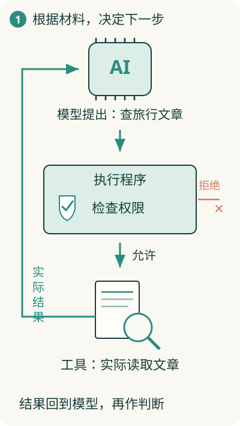

# 聊天 AI 怎样变成能替你做事的助手？

你说“找出我收藏里与旅行有关的文章，整理一份摘要”。普通回答可能直接给出建议；能做事的助手需要查收藏、取得文章、读结果，再决定下一步。

**Agent 可以先理解成：让模型参与决定后续行动，并根据执行结果继续工作的系统**。它需要模型之外的执行能力。

## 从建议到行动，中间还要有人执行

模型可以提出“查询旅行文章”。真正查询数据库的，是软件提供的查询能力。供助手调用的具体能力，常叫**工具**，例如查找文章、读取正文。

把模型、工具、权限和运行过程组织起来的程序，可以叫**宿主**。模型输出一个行动要求，宿主检查并调用工具，再把结果给模型看。仅输出“已删除文章”，不等于真的执行了删除。

## 反馈让下一步可以改变

第一次查询找到20篇，模型可能只读其中几篇；如果没找到，它可能换搜索词。它根据新结果调整行动，而不是只在开头生成一段长计划。

这个循环需要明确什么时候停止：已经完成、没有可用资料、遇到错误，或者达到步数和资源限制。否则系统可能一直查下去，却没有更有用的结果。

## 固定工作流和 Agent 怎样区分？

如果顺序事先规定为“收到文章→生成摘要→保存”，路径主要由软件预先安排，通常称为**工作流**。

如果某些后续步骤由模型根据结果动态选择，就更接近 Agent。真实产品可以组合两者：外层保持固定审核流程，里面允许模型选择查询方式。自主程度有高有低，并非每个 AI 产品都需要同样自由度。

## 能做事，也要知道哪些事不能做

读文章和删除全部收藏，是不同权限。工具范围、访问身份和重要动作的确认，应由系统落实。模型的判断不能替代执行位置的[权限检查](../05-reliability/18-trust.md)。

Agent 把决定、执行和反馈连接成循环；它依然有[状态](../02-state/06-state.md)、[等待](../03-communication/12-time.md)、失败和成本。这也是为什么“接一个模型”与“做一个可靠助手”之间，还有许多普通软件工作。
